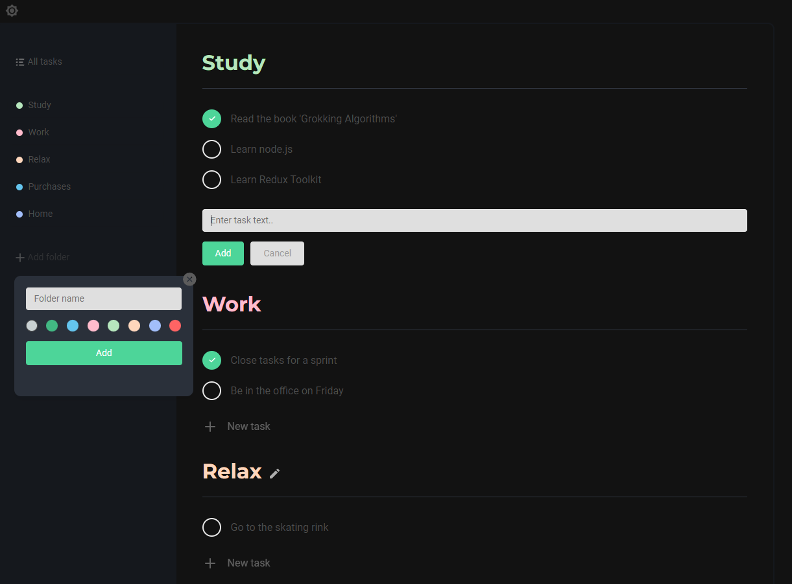

# Todo-list with React

### Stack:
- react
- react-router-dom
- hooks
- json-server
- scss
- material ui

### How to run the application locally on your computer (use `main` branch):

For client run: `npm start`

For json-server run: `npm run json-server`

